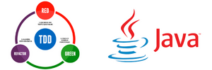
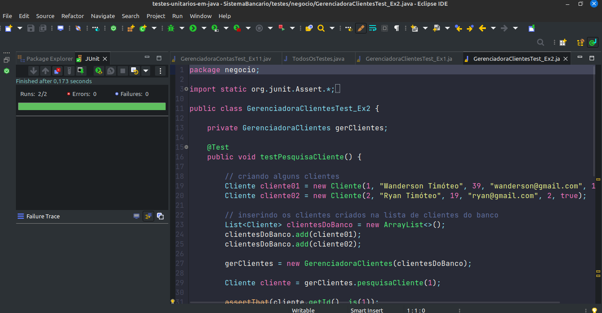
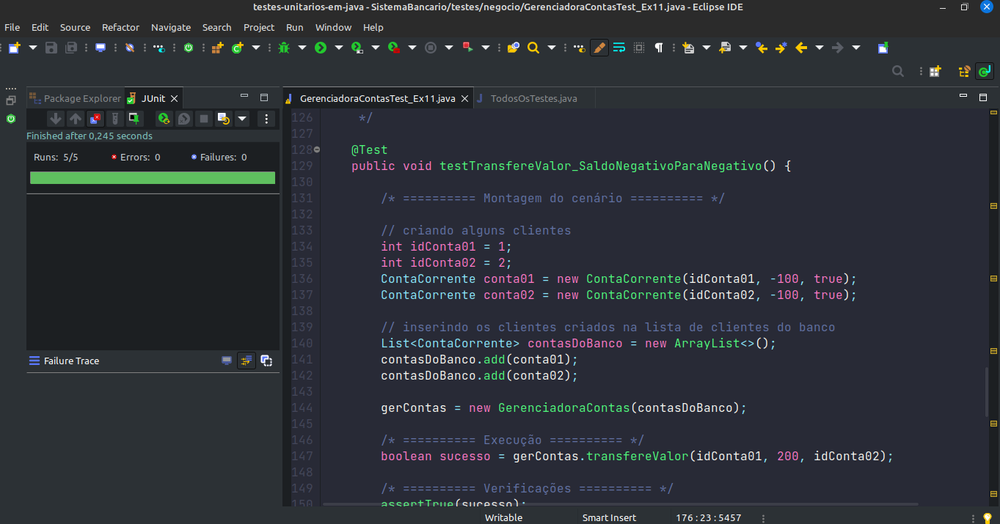
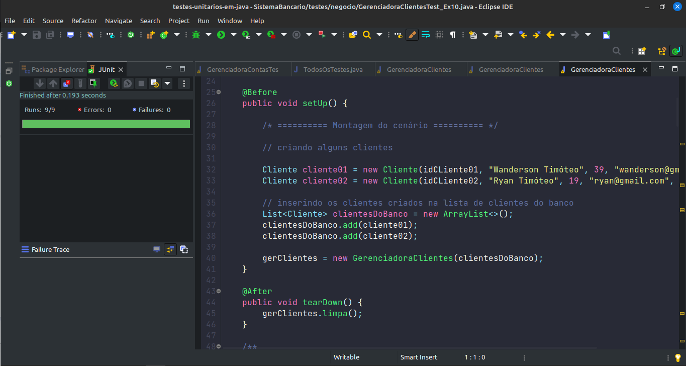
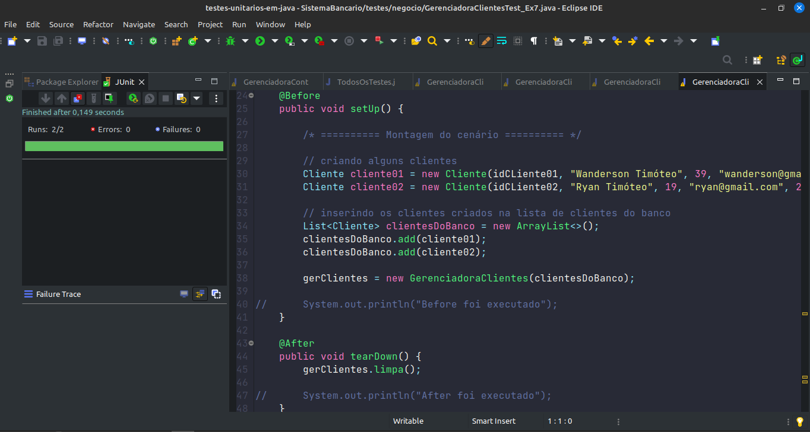

<h1 align="center">
  
  <br>
  Desenvolvimento Orientado a Testes
</h1>

<div align="center">
  <a href="#-projeto">Projeto</a>&nbsp;&nbsp;&nbsp;|&nbsp;&nbsp;&nbsp;
  <a href="#-tecnologias">Tecnologias</a>&nbsp;&nbsp;&nbsp;|&nbsp;&nbsp;&nbsp;
  <a href="#-licença">Licença</a>&nbsp;&nbsp;&nbsp;|&nbsp;&nbsp;&nbsp;
  <a href="#-autor">Autor</a>
</div>

<br> 

<p align="center">
  
  
  
</p>

<br>

## 💻 Projeto

Estes são meus testes unitários desenvolvidos na linguagem de programação Java, durante meus estudos em TDD.

### *Teste Pesquisar e Remover Cliente*

<p>Neste é simulado um cenário de um sistema bancário</p>

<p align="center">
    
</p>

<br>
<br>

### *Teste saldo negativo e idade não permitida para criar conta*

<p align="center">
    
</p>
<br>

### *Teste Before e After*

<p align="center">
    
</p>
<br>

### *Teste setUp e tearDown*

<p align="center">
    
</p>
<br>

### *Teste setUp e tearDown*

<p align="center">
    
</p>
<br>

## 🚀 Tecnologias

Esse projeto foi desenvolvido com as seguintes tecnologias e ferramentas:

- [Java](https://docs.oracle.com/en/java/)
- [JUnit](https://www.tutorialspoint.com/junit/index.htm)
- [Mockito](https://site.mockito.org/)

<br>

## 🔥 Executar Aplicação

### 🎇 Executando Localmente a Aplicação

Caso você deseja executar o projeto na sua máquina local, basta seguir os passos abaixo:

### 🌀 Começando...

Para começar, você deve simplesmente clonar o repositório do projeto na sua máquina.

Navegue em seu computador até o local onde você clonou o projeto, exemplo:

```sh
C:\Users\NomeDoComputador\Documents\CloneDoProjeto
```

Quando encontrar a pasta do projeto, basta acessar `testes-unitarios-em-java`. 

### 🛰️ Executando o projeto

<p>Bom, agora basta você importar o projeto clonado em sua IDE de preferência (Eu uso o Eclipse) e vc poderá executar cada um individualmente.
</p>

<br>

<p> O Sistema Bancário no diretorio src/negocio você poderá executar o arquivo Main.java clicando com mouse direito procurando 'Run As' depois em 'Java Apllication', assim conseguirá ver as funcionalidades do sistema.</p>

<br>

E no diretório testes/negocio você poderá executar cada testes clicando com o mouse direito sobre o arquivo, procurar por 'Run As' depois clicar em 'Junit Test'.

Pronto! dessa forma o projeto `testes-unitarios-em-java` estará rodando localmente em sua maquina.

<br>

## 🚩 Tenho Dúvidas... O que fazer?

Caso tenha dúvidas sobre o código do projeto, sintam-se a vontade em abrir uma **[ISSUE AQUI](https://github.com/Wanderson-A-Timoteo/testes-unitarios-em-java/issues)**. Assim que possível, responderei todas as dúvidas!

<br>

## 💡 Licença

Esse projeto está sob a licença MIT. Veja o arquivo [LICENSE](github/LICENSE.md) para mais detalhes.

<br>

## 🎆 Autor

Feito com ♥ by

-  [**Wanderson A. Timóteo**](https://www.wandersontimoteo.ga/)

<br>

## 🤝 Agradecimentos


<div align="center">
  

<br>

[Gustavo Farias](https://www.udemy.com/course/testes-unidade-automaticos-software-junit/)
<br>

` Testes Unitários em Java Utilizando o JUnit `

<div align="center">
  
</div>

<br>

<br>

[Francisco Wagner Costa](https://www.udemy.com/course/testes-unitarios-em-java/)
<br>

` Testes unitários em JAVA: Domine JUnit, Mockito e TDD `
<div align="center">
    
</div>

<br>

Estudo desenvolvido durante as aulas dos cursos <br>` "Testes Unitários em Java Utilizando o JUnit" ` <br> e <br> ` "Testes unitários em JAVA: Domine JUnit, Mockito e TDD" ` da plataforma de Ensino [Udemy](https://www.udemy.com/).
